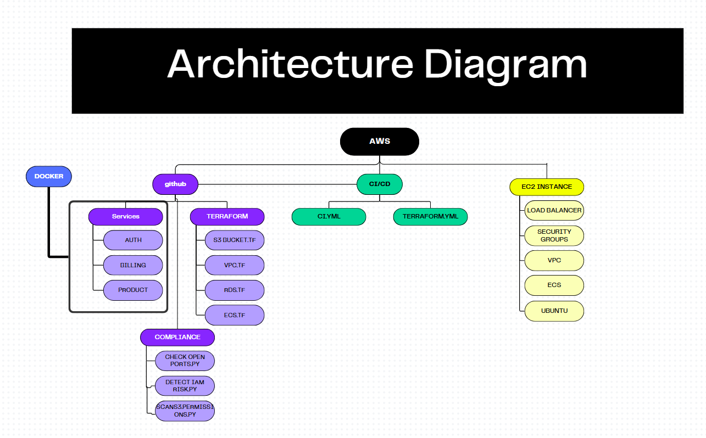

# Secure Microservices Platform with Continuous Compliance Checks

## 🚀 Project Overview

This project demonstrates how to build a secure and scalable microservices platform using DevOps and DevSecOps principles. Key features include:

- Containerized microservices deployed on AWS ECS using Fargate and Docker
- Infrastructure provisioned via Terraform
- CI/CD automation with GitHub Actions
- Real-time compliance scanning with custom Python scripts
  
---

## 🔧 Technologies Used

- AWS Services: EC2, ECS, VPC, IAM, S3
- IaC: Terraform
- Containers: Docker, ECS
- CI/CD: GitHub Actions
- Monitoring: Bash & Python scripts, Trivy for security scans
- Languages: Python (Flask)

---

## 🌐 Infrastructure Overview

- EC2 Instance: Acts as a bastion host or compliance runner.
- ECS + Fargate: Hosts containerized microservices (auth, billing, product).
- IAM: Fine-grained access policies enforced via Terraform.
- S3: Secure bucket for logs, static assets with lifecycle policies.
- VPC: Secure network configuration with public/private subnets.

---

## ⚙️ CI/CD Pipeline

GitHub Actions automates:

- Code linting and testing
- Docker image builds and deployment
- Container security scanning using Trivy

---

## 🛡️ Compliance Automation

Custom Python/Bash scripts to detect:

- IAM users with overly permissive policies (e.g., AdministratorAccess)
- Publicly accessible S3 buckets (AllUsers grants)
- Open security group ports (e.g., SSH on port 22, HTTP on port 80)
Scripts use AWS SDK (boto3) to inspect configurations in us-east-1.

---



---
## 📁 Project Structure

```bash
secure-microservices-compliance-platform/
├── terraform/                  # Terraform IaC scripts (VPC, ECS, IAM, etc.)
├── services/               # Flask-based microservice applications
├── compliance/                # Security/compliance scan scripts (Python/Bash)
├── .github/workflows/      # CI/CD pipeline definitions
├── docker-compise.yml
